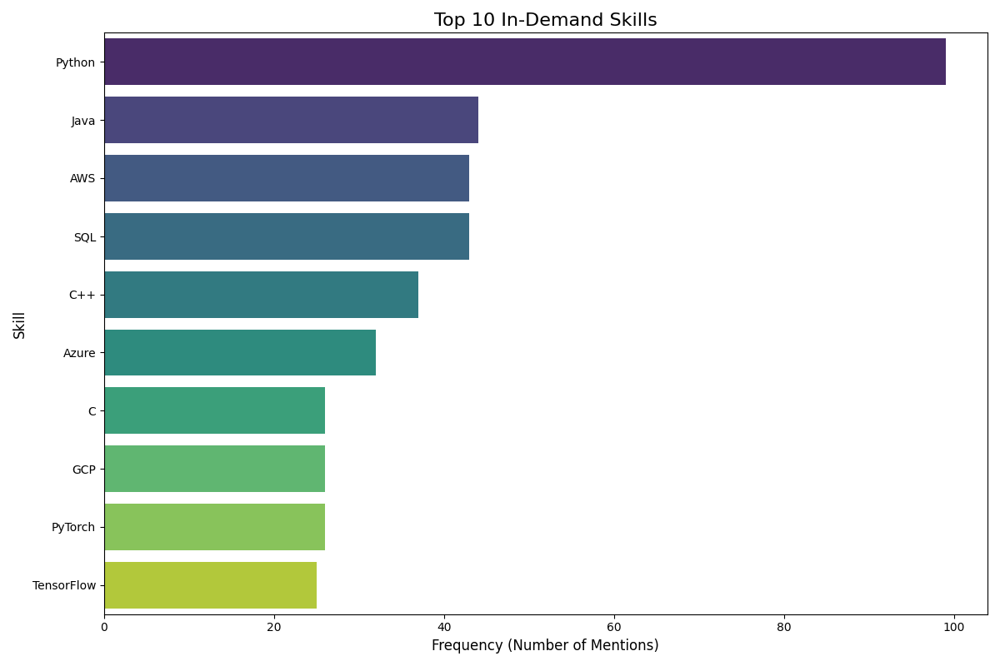
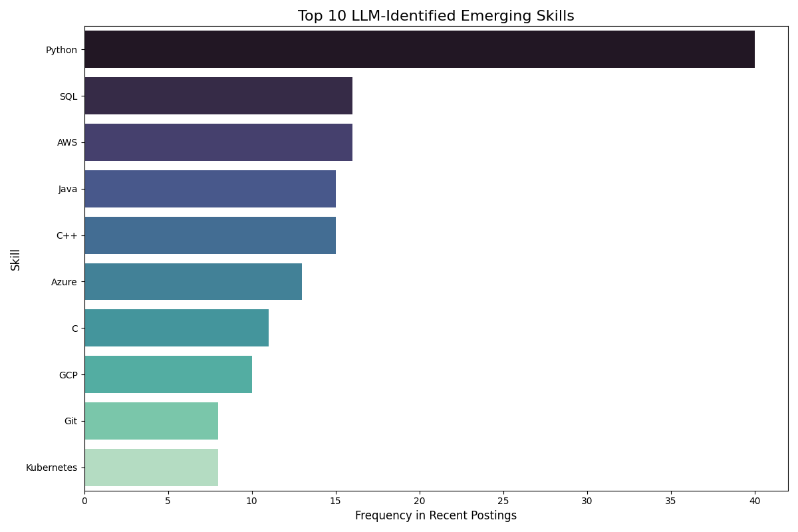

# Job Market Skills Analysis

## Executive Summary
This report analyzes recent job market skill data to provide strategic insights for our company, a leading semiconductor firm focused on AI, data center, and network solutions. Our analysis of "Top In-Demand Skills" and "Emerging Skills" charts reveals a critical emphasis on foundational programming, cloud infrastructure, and AI/ML frameworks. Python stands out as a dominant skill across both categories, alongside persistent demand for C/C++, cloud platforms (AWS, Azure, GCP), and data management (SQL). Emerging trends highlight the growing importance of DevOps tools like Git and Kubernetes, signaling a shift towards more agile, scalable, and collaborative development practices.

To achieve our goal of accelerating AI and data infrastructure and enabling custom silicon solutions, we must proactively align our talent strategy with these trends. This includes targeted recruitment, strategic upskilling, and fostering a culture that embraces collaborative, high-performance engineering, ensuring our continued leadership in custom silicon, reliable execution, and deep customer partnerships.

---

##

## Top In-Demand Skills

### Key Insights from the 'Top In-Demand Skills' Chart
Key Insightsfrom the 'Top In-Demand Skills' Chart (`top_skills.png`)

The 'Top In-Demand Skills' chart provides a snapshot of the most sought-after competencies in our industry, directly informing our core talent needs.

*   **Dominance of Python (99 Frequency):** Python is the clear leader, nearly double the frequency of the next most requested skill. This underscores its foundational role in data science, AI/Machine Learning, scripting, and automation—all critical areas for developing AI systems and processing vast amounts of data at high speeds, aligning perfectly with our core business focus.
*   **Pervasive Cloud Platform Expertise (AWS, Azure, GCP):** AWS, Azure, and GCP collectively represent a significant portion of in-demand skills. This highlights the indispensable nature of cloud infrastructure knowledge for scalable data centers, networked environments, and deploying AI solutions, which are central to our target markets.
*   **Foundational Programming Languages (Java, C++, C):** Java, C++, and C maintain strong demand. C and C++ are particularly vital for low-level programming, embedded systems (crucial for automotive chips), and developing power-efficient, high-performance custom silicon solutions—a key strength of our company. Java’s versatility supports various enterprise-level applications.
*   **Data Management Remains Key (SQL):** SQL's high frequency emphasizes the continuous need for robust data handling, querying, and management capabilities, essential for supporting complex AI and data infrastructure.
*   **AI/ML Frameworks (PyTorch, TensorFlow):** The inclusion of PyTorch and TensorFlow explicitly confirms the high demand for specialized AI/ML development skills, directly supporting our mission to accelerate AI and enable optimized custom silicon for AI computing.

---

##

## Emerging Skills

### Key Insights from the 'Emerging Skills' Chart
# People Analytics Strategic Report: Leveraging Skill Trends for Accelerated AI & Data Infrastructure

## Executive Summary

This report analyzes recent job market skill data to provide strategic insights for our company, a leading semiconductor firm focused on AI, data center, and network solutions. Our analysis of "Top In-Demand Skills" and "Emerging Skills" charts reveals a critical emphasis on foundational programming, cloud infrastructure, and AI/ML frameworks. Python stands out as a dominant skill across both categories, alongside persistent demand for C/C++, cloud platforms (AWS, Azure, GCP), and data management (SQL). Emerging trends highlight the growing importance of DevOps tools like Git and Kubernetes, signaling a shift towards more agile, scalable, and collaborative development practices.

To achieve our goal of accelerating AI and data infrastructure and enabling custom silicon solutions, we must proactively align our talent strategy with these trends. This includes targeted recruitment, strategic upskilling, and fostering a culture that embraces collaborative, high-performance engineering, ensuring our continued leadership in custom silicon, reliable execution, and deep customer partnerships.

---

## Key Insights from the 'Top In-Demand Skills' Chart (`top_skills.png`)

The 'Top In-Demand Skills' chart provides a snapshot of the most sought-after competencies in our industry, directly informing our core talent needs.

*   **Dominance of Python (99 Frequency):** Python is the clear leader, nearly double the frequency of the next most requested skill. This underscores its foundational role in data science, AI/Machine Learning, scripting, and automation—all critical areas for developing AI systems and processing vast amounts of data at high speeds, aligning perfectly with our core business focus.
*   **Pervasive Cloud Platform Expertise (AWS, Azure, GCP):** AWS, Azure, and GCP collectively represent a significant portion of in-demand skills. This highlights the indispensable nature of cloud infrastructure knowledge for scalable data centers, networked environments, and deploying AI solutions, which are central to our target markets.
*   **Foundational Programming Languages (Java, C++, C):** Java, C++, and C maintain strong demand. C and C++ are particularly vital for low-level programming, embedded systems (crucial for automotive chips), and developing power-efficient, high-performance custom silicon solutions—a key strength of our company. Java’s versatility supports various enterprise-level applications.
*   **Data Management Remains Key (SQL):** SQL's high frequency emphasizes the continuous need for robust data handling, querying, and management capabilities, essential for supporting complex AI and data infrastructure.
*   **AI/ML Frameworks (PyTorch, TensorFlow):** The inclusion of PyTorch and TensorFlow explicitly confirms the high demand for specialized AI/ML development skills, directly supporting our mission to accelerate AI and enable optimized custom silicon for AI computing.

---

## Key Insights from the 'Emerging Skills' Chart (`emerging_skills.png`)

The 'Emerging Skills' chart offers a forward-looking perspective, indicating competencies gaining traction and shaping future requirements.

*   **Sustained Core Demand:** The top emerging skills largely mirror the top in-demand skills (Python, SQL, AWS, Java, C++, Azure, C, GCP), albeit with different frequencies. This indicates that the core foundational skills remain crucial and are still experiencing growth in demand, signifying their long-term strategic importance.
*   **Python's Enduring Relevance:** Python continues to hold the top spot in emerging skills, reaffirming its foundational and growing importance across AI, data processing, and general software development within our industry.
*   **Rise of Collaborative Development and Orchestration (Git, Kubernetes):** The appearance of Git and Kubernetes in the top 10 emerging skills is highly significant.
    *   **Git (Version Control):** Its emergence signals a growing emphasis on collaborative software development practices, code integrity, and efficient workflow management, supporting our "reliable execution" and "shoulder-to-shoulder collaboration" work style.
    *   **Kubernetes (Container Orchestration):** This indicates a strong trend towards scalable, distributed application deployment and management, particularly relevant for our data center, network, and cloud-focused solutions. It’s critical for managing complex AI workloads and microservices architectures efficiently.
*   **Cloud-Native Adoption:** The combined presence of cloud platforms and Kubernetes underscores a clear industry move towards cloud-native architectures and DevOps practices.

---

##

## Actionable Recommendations
Actionable RecommendationsBased on the analysis of current and emerging skill trends, the following recommendations are specifically tailored to strengthen our company's position in its target markets (Data Center, Automotive, Enterprise, Carrier) and achieve its strategic goals:

1.  **Double Down on AI/ML & High-Performance Computing Expertise:**
    *   **Action:** Launch an accelerated internal upskilling program focused on advanced Python, PyTorch, and TensorFlow, including specialized modules for large-scale AI model deployment, MLOps, and efficient inference on custom silicon.
    *   **Tailoring:** This directly supports our "accelerate AI" goal and bolsters our "AI computing" solutions for data centers and networks.
    *   **Action:** Invest in advanced training and recruitment for C/C++ engineers with expertise in hardware-software co-design, low-latency systems, and power optimization.
    *   **Tailoring:** This is critical for our "custom silicon" development, "power-efficient, high-performance systems," and specialized chips for the "automotive market."

2.  **Accelerate Cloud-Native & DevOps Transformation:**
    *   **Action:** Establish a comprehensive certification and training roadmap for all relevant engineering teams in AWS, Azure, and GCP, emphasizing architectural best practices for AI workloads and large-scale data processing.
    *   **Tailoring:** Directly supports our "data centers," "networks," and "cloud" market segments, enabling customers to build optimized solutions.
    *   **Action:** Implement mandatory training and adoption programs for Git best practices and establish internal Kubernetes expertise centers. Focus on applying these tools to CI/CD pipelines for custom silicon validation and software delivery.
    *   **Tailoring:** This enhances "reliable execution" and fosters "shoulder-to-shoulder collaboration," allowing for more agile development cycles for our complex solutions. It's crucial for delivering scalable infrastructure for "data centers" and "carrier infrastructure."

3.  **Cultivate Cross-Functional Data Management & Analytics Capabilities:**
    *   **Action:** Develop targeted learning paths in advanced SQL, data warehousing, and big data technologies (e.g., Spark, distributed databases) for engineers across product development and customer solution teams.
    *   **Tailoring:** Enhances our ability to manage and analyze the vast data generated by "AI systems," "networks," and "smart cars," underpinning our capability to provide optimized data-processing solutions.

4.  **Strategic Talent Acquisition & Partnerships:**
    *   **Action:** Refine recruitment strategies to explicitly target candidates with proven experience in custom silicon *and* relevant AI/Cloud skills. Leverage our "deep customer partnerships" to explore joint recruitment or talent exchange programs where specific skill sets are mutually beneficial.
    *   **Tailoring:** Attracts talent uniquely suited for our niche, high-performance offerings. Joint programs reinforce our "shoulder-to-shoulder collaboration" ethos.
    *   **Action:** Strengthen academic partnerships with universities renowned for their programs in electrical engineering, computer science, and AI, especially those with strong hardware-software co-design research.
    *   **Tailoring:** Creates a pipeline for future talent specializing in the foundational areas of "custom silicon" and "power-efficient systems."

5.  **Amplify Employer Brand for Unique Value Proposition:**
    *   **Action:** Revamp recruitment messaging and career pages to prominently feature our unique value proposition: the opportunity to work at the intersection of custom silicon, AI, high-performance computing, and deep customer collaboration. Highlight specific projects in "AI systems," "data centers," "smart cars," and "5G networks."
    *   **Tailoring:** Attracts top-tier talent who are passionate about solving complex, real-world problems and contributing to groundbreaking technology that processes and moves data very fast.

By strategically investing in these skill areas and aligning our talent initiatives with our core business strengths and market demands, we will ensure our continued leadership in accelerating AI and data infrastructure.
